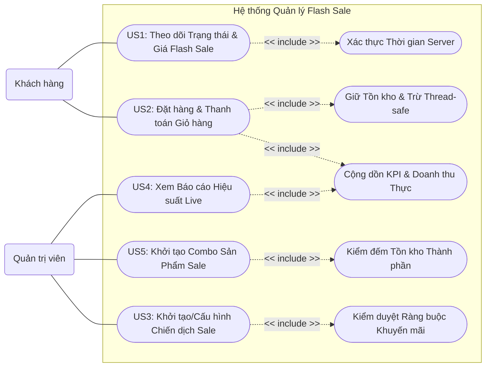

# Tổng Quan: Sơ đồ Use Case Toàn Dự Án

Sơ đồ dưới đây trình bày các Use Case (ca sử dụng) chính của hệ thống Flash Sale đại diện cho góc nhìn nghiệp vụ tương tác giữa người dùng (Actor: Admin, Customer) và hệ thống (System). 

*Lưu ý: Sơ đồ không sử dụng định dạng màu sắc theo yêu cầu, tập trung hoàn toàn vào rành mạch luồng dữ liệu và quan hệ nghiệp vụ.*

## 1. Sơ đồ Use Case Toàn Cảnh (Global Use Case Diagram)

## 2. Diễn giải chi tiết các Use Case

Sơ đồ bao phủ đầy đủ 5 User Stories (US) và các nghiệp vụ phía sau hệ thống:

### A. Nhóm Tương Tác Của Khách Hàng (Customer)
* **US1 (Theo dõi Trạng thái & Giá):** Khách hàng sẽ truy cập giao diện xem sản phẩm. Hệ thống tự động đẩy thêm hành động bắt buộc (`<<include>>`) là "Xác thực Thời gian Server", nhằm kết nối trực tiếp xuống khối Entity `FlashSaleCampaign` xem cửa sổ Sale đã mở cửa chưa hay đã đóng, để đưa ra thông tin cực kỳ chính xác.
* **US2 (Đặt hàng & Thanh toán):** Hành động cốt lõi của người mua. Quá trình bấm thanh toán này bắt buộc (`<<include>>`) hai logic lõi bảo mật đồng thời:
    1. Trừ kho an toàn: Trỏ tới khối Entity `FlashSaleInventory` để giữ chỗ, đảm bảo Atomic - không một ai có thể mua trùng/over-booking.
    2. Cập nhật Doanh thu: Báo lệnh về Data Analytics để thay đổi KPI hệ thống.

### B. Nhóm Tương Tác Của Quản Trị Viên (Admin)
* **US3 (Cấu hình chiến dịch):** Admin mở Form lịch và ghi giá sản phẩm. Thao tác này có phần `<<include>>` kiểm tra quy định (không quá giá trần biên lợi nhuận), một bước chặn hoàn toàn tự động phía trong Controller/Entity chặn mọi hành vi nhập láo.
* **US5 (Tạo Combo):** Admin kéo thả nhóm nhiều các mặt hàng nhỏ vào một Khay Combo tổng để Sale gộp. Hệ thống bắt buộc `<<include>>` quá trình đếm kho của từng mặt hàng đơn lẻ bên trong - nếu thứ cấu thành bị rỗng, hộp Combo sẽ vô hiệu hóa ngay không cho tạo.
* **US4 (Xem Dashboard Báo cáo Máy Chủ):** Admin chỉ việc bấm vào Xem. Hệ thống chia sẻ lại node Use Case nội bộ "Cộng dồn KPI" mà bộ Check-out gửi về (Giống US2). Cách xây dựng này phơi bày rõ tư duy cấu trúc Real-time RAM, đọc từ lõi `SaleAnalytics`.

## 3. Bản đồ Use Case đối chiếu với Kiến trúc BCE

Trong Use Case, ranh giới thiết kế BCE (Boundary - Control - Entity) được phân chia rõ nét như sau:

* **Từ Actor đến Use Case chính:** Khi "Khách Hàng" nối vào "Đặt đồ vào Giỏ" -> Những mũi tên nét liền này tương ứng với mặt tiền cửa hàng (Layer **Boundary**), thứ đại diện cho Giao diện UI/Webform khách nhìn thấy.
* **Các Use Case mang mã US (US1..US5):** Đóng vai trò là các Node tiếp nhận Action chính của hệ thống. Đây chính là Layer **Control**, giúp điều hướng hành động tương tự như người chia bài ở Casino.
* **Các Node "<< include >>":** Là cốt lõi sâu nhất không thể phá vỡ, chứa toàn bộ "vũ khí phòng vệ" (Khóa Thread-safe, bắt lỗi tỷ lệ quá 50%) -> Đây đích thị là công việc của hệ thống Layer **Entity** làm nhiệm vụ che chở Data Model.
